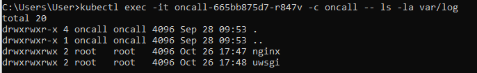
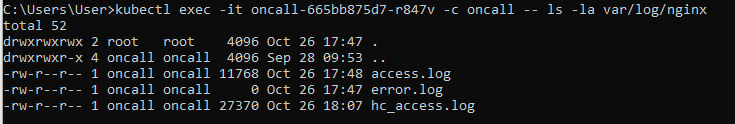
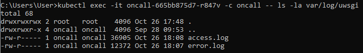
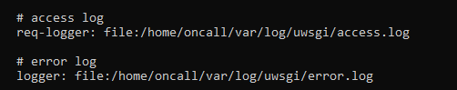
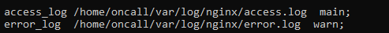
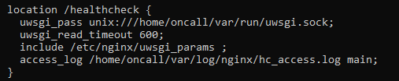
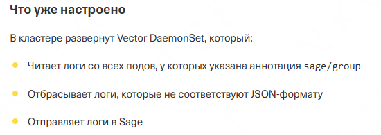
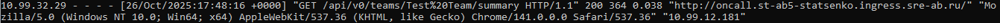
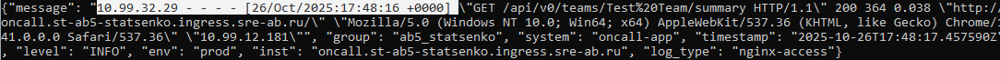
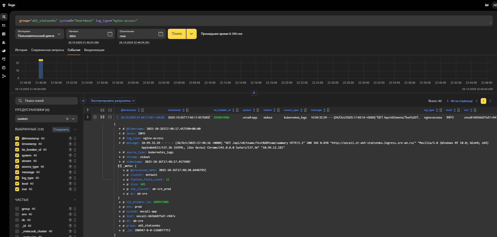

# Путь логов от их появления в приложении Oncall до попадания в систему Sage.

В приложении oncall логи пишутся в файлы, которые расположены в директории var/log:



Логи пишутся в 5 файлов: 
- nginx/access.log
- nginx/error.log
- nginx/hc_access.log
- uwsgi/access.log
- uwsgi/error.log

Данные файлы указаны в конфигурационных файлах nginx.conf и uwsgi.yaml, которые расположены в директории daemons:

Файл daemons/uwsgi.yaml:


Файл daemons/nginx.conf:



Перейдем к deployment.yaml для oncall
```
apiVersion: apps/v1
kind: Deployment
metadata:
  name: oncall
  namespace: st-ab5-statsenko
  labels:
    app.kubernetes.io/name: oncall
    app.kubernetes.io/component: web
spec:
  replicas: 1
  selector:
    matchLabels:
      app.kubernetes.io/name: oncall
      app.kubernetes.io/component: web
  template:
    metadata:
      labels:
        app.kubernetes.io/name: oncall
        app.kubernetes.io/component: web
      annotations:
        sage/group: "ab5_statsenko"
    spec:
      containers:
        - name: oncall
          resources:
            requests:
              cpu: 200m
              memory: 256Mi
            limits:
              cpu: 500m
              memory: 512Mi
          image: knucksie/sre-ab-oncall:0.1
          env:
            - name: DOCKER_DB_BOOTSTRAP
              value: "1"
          imagePullPolicy: IfNotPresent
          ports:
            - containerPort: 8080
          livenessProbe:
            httpGet:
              path: /healthcheck
              port: 8080
            failureThreshold: 3
            initialDelaySeconds: 15
            periodSeconds: 10
          readinessProbe:
            httpGet:
              path: /healthcheck
              port: 8080
            failureThreshold: 3
            initialDelaySeconds: 15
            periodSeconds: 10
          startupProbe:
            httpGet:
              path: /healthcheck
              port: 8080
            failureThreshold: 10
            initialDelaySeconds: 30
            periodSeconds: 10
          volumeMounts:
            - name: oncall-config
              mountPath: /home/oncall/config/config.yaml
              subPath: oncall.conf
              readOnly: true
            - name: nginx-logs
              mountPath: /home/oncall/var/log/nginx
            - name: uwsgi-logs
              mountPath: /home/oncall/var/log/uwsgi
        - name: log-processor
          resources:
            requests:
              cpu: 50m
              memory: 64Mi
            limits:
              cpu: 100m
              memory: 128Mi
          image: python:3.9-alpine
          command: ["/bin/sh"]
          args: 
          - "-c"
          - |
            cat > /tmp/log_processor.py << 'EOF'
            #!/usr/bin/env python3
            import sys, json, time, re
            from datetime import datetime
            
            error_log_level = "ERROR"
            warning_log_level = "WARN"
            info_log_level = "INFO"
            
            log_level_patterns = [
                (re.compile(r'\[error\]|\berror\b', re.IGNORECASE), error_log_level),
                (re.compile(r'\[warn\]|\bwarn\b', re.IGNORECASE), warning_log_level),
                (re.compile(r'\[info\]|\binfo\b', re.IGNORECASE), info_log_level)
            ]
            
            pattern_5xx_with_spaces = re.compile(r'\s5\d\d\s')
            pattern_5xx_with_brackets = re.compile(r'\[5\d\d\]')
            pattern_4xx_with_spaces = re.compile(r'\s4\d\d\s')
            pattern_4xx_with_brackets = re.compile(r'\[4\d\d\]')
            timestamp_format = "%Y-%m-%dT%H:%M:%S.%fZ"
            
            group = "ab5_statsenko"
            system = "oncall-app"
            env = "prod"
            inst = "oncall.st-ab5-statsenko.ingress.sre-ab.ru"
            
            def detect_log_level(message):
                for pattern, level in log_level_patterns:
                    if pattern.search(message):
                        return level
                        
                if (pattern_5xx_with_spaces.search(message) or
                   pattern_5xx_with_brackets.search(message)):
                    return error_log_level
                    
                if (pattern_4xx_with_spaces.search(message) or
                   pattern_4xx_with_brackets.search(message)):
                    return warning_log_level
                
                return info_log_level
            
            log_type = sys.argv[1]
            while True:
                line = sys.stdin.readline()
                if line.strip():
                    log_entry = {
                        "message": line.strip(),
                        "group": group,
                        "system": system,
                        "timestamp": datetime.utcnow().strftime(timestamp_format),
                        "level": detect_log_level(line.strip()),
                        "env": env,
                        "inst": inst,
                        "log_type": log_type
                    }
                
                    print(json.dumps(log_entry))
                    sys.stdout.flush()
            EOF
            tail -F /nginx-logs/access.log | python3 /tmp/log_processor.py nginx-access &
            tail -F /nginx-logs/error.log | python3 /tmp/log_processor.py nginx-error &
            tail -F /nginx-logs/hc_access.log | python3 /tmp/log_processor.py nginx-hc-access &
            tail -F /uwsgi-logs/access.log | python3 /tmp/log_processor.py uwsgi-access &
            tail -F /uwsgi-logs/error.log | python3 /tmp/log_processor.py uwsgi-error &
            wait
          volumeMounts:
            - name: nginx-logs
              mountPath: /nginx-logs
            - name: uwsgi-logs
              mountPath: /uwsgi-logs
      volumes:
        - name: oncall-config
          configMap:
            name: oncall
        - name: nginx-logs
          emptyDir: {}
        - name: uwsgi-logs
          emptyDir: {}
```
В шаблоне пода представлены два контейнера - приложение **oncall** и **sidecar-контейнер**. В deployment присутствуют следующие volume: **oncall-config** (для конфигурации), **nginx-logs** (общая директория для логов от nginx), **uwsgi-logs** (общая директория для логов от uwsgi).

Главная задача nginx-logs и uwsgi-logs - обеспечить общий доступ к лог-файлам для двух разных контейнеров в одном поде. 
- Контейнер oncall пишет логи в файлы
- Контейнер log-processor читает лог-файлы

log-processor отслеживает изменения со всех 5 лог-файлов в режиме реального времени. 

Прочитав новые логи, **log-processor** будет преобразовывать их в **json-формат**. В поле **message** передается сам лог, в **timestamp** передается текущее время, в **log_type** аргумент, который передается вместе с файлом (например, nginx-access для файла nginx/access.log). Это необходимо для того, чтобы мы могли определить, в каком файле содержится данный лог.

В следующие поля передаются фиксированные значения:
- group
- system
- env
- inst

Уровень логирования (log_level) вычисляется по наличию в логе слов warn, error, info и кодов ответа.

После создания json log-processor пишет его в stdout.

Далее Vector DaemonSet читает логи с нашего пода, поскольку у нас указана аннотация sage/group. Все наши логи имеют json формат, которые соответвуют требованиям Sage и не будут отброшены Vector DaemonSet. Все наши логи Vector DaemonSet отправил в Sage.


Приведу пример лога из файла nginx/access.log:

Данный лог был записан приложением oncall. Далее этот файл читает log-processor и преобразует лог к json-формату и выводит его в stdout:

Далее Vector DaemonSet получит лог из stdout и отправит его в Sage:
