# Демонстрация
```
Итоговый дашборд: https://sage.sre-ab.ru/grafana/d/ff975a8c-8f22-49c3-bcf7-e3546bd86f61/application-health-and-sla-dashboard?orgId=160
```

## Описание панелей
### Результаты выполнения readiness probe
Метрика **kube_pod_container_status_ready** показывает текущий статус готовности контейнера в поде, отвечает на вопрос: **может ли контейнер принимать трафик**.
Возможные значения метрики на графике: 
- UP (готов принимать трафик);
- DOWN (не готов принимать трафик)

Панель для контейнера **Oncall**:

Панель для контейнера **MySQL**:
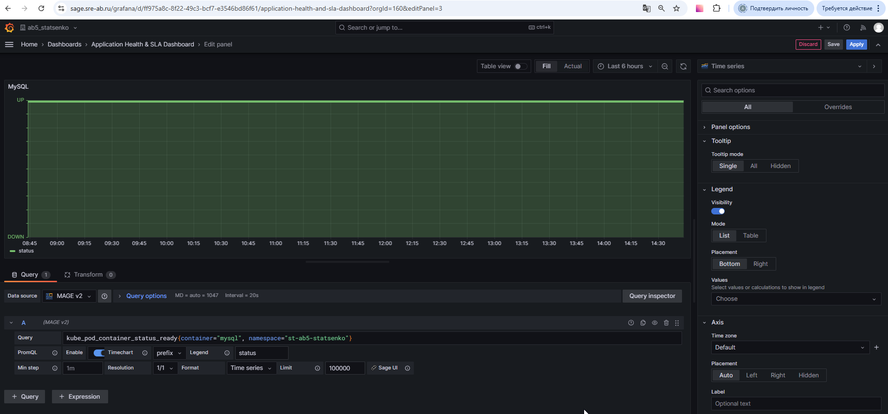

### Ресурсы контейнеров
**rate(container_cpu_usage_seconds_total{container="container_name", namespace="st-ab5-statsenko"}[5m]) * 100** показывает процент использования CPU контейнером за последние 5 минут. Благодаря данной метрике мы можем понять, сколько ресурсов реально потребляет контейнер.
```
Например, если контейнер стабильно использует 5% ресурсов, лимиты можно уменьшить, иначе увеличить. 
```
**container_memory_usage_bytes{container="container_name", namespace="st-ab5-statsenko"}** показывает текущее потребление оперативной памяти контейнером. Данная метрика помогает отслеживать, оптимизировать и планировать ресурсы для контейнеризованных приложений.

Панель для контейнера **Oncall**:
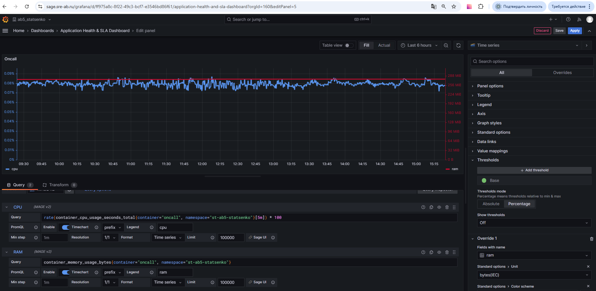
Панель для контейнера **MySQL**:
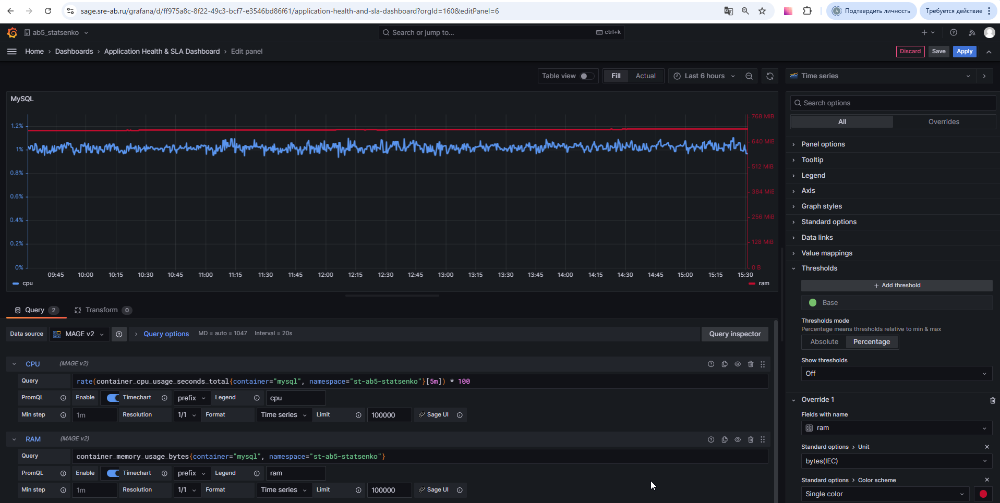

### Дополнительные метрики

**increase(kube_pod_container_status_restarts_total{container="container_name", namespace="st-ab5-statsenko"}[1h])** показывает количество рестартов контейнера за последний час. Данная метрика была выбрана, поскольку является индикатором стабильности работы приложения, который помогает выявлять проблемы с надежностью приложения.

Панель для контейнера **Oncall**:
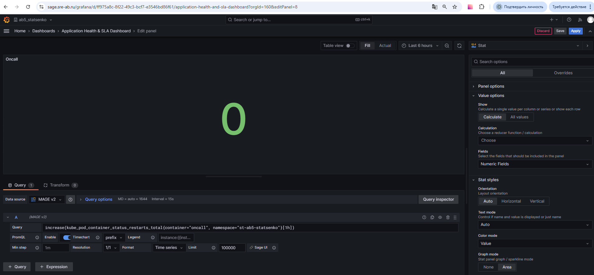
Панель для контейнера **MySQL**:
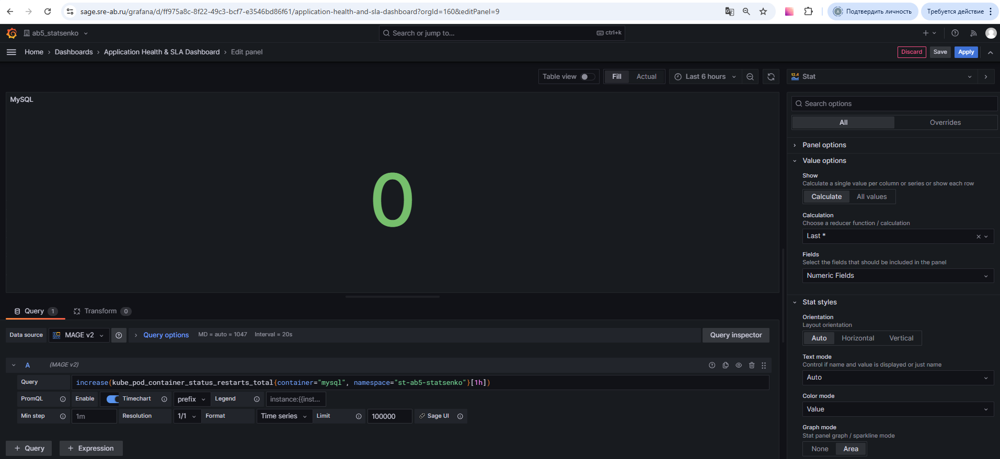

**python_gc_objects_uncollectable_total{system=~"oncall-service", namespace="st-ab5-statsenko"}** показывает количество объектов в памяти, которые не могут быть собраны сборщиком мусора (Garbage Collector). Метрика важна, так как с помощью нее можно обнаружить несобираемые объекты и предотвратить OOMKill. Также эти объекты накапливаются в памяти навсегда, создавая постепенную утечку памяти.

Панель для контейнера **Oncall**:
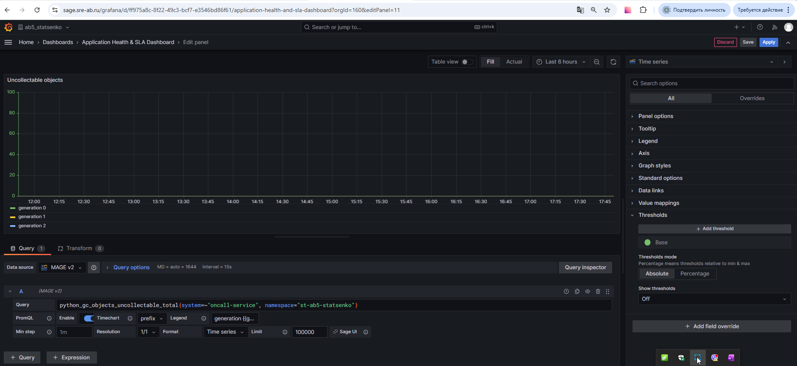

**rate(python_gc_objects_collected_total{system=~"oncall-service", namespace="st-ab5-statsenko"}[5m])** используется для расчета скорости сборки мусора. 

Выбрана для визуализации, поскольку, если скорость сборки мусора постоянно высокая, это говорит о том, что приложение создает огромное количество короткоживущих объектов.  Визуализация метрики в Grafana позволяет вовремя заметить такую аномалию.

Панель для контейнера **Oncall**:
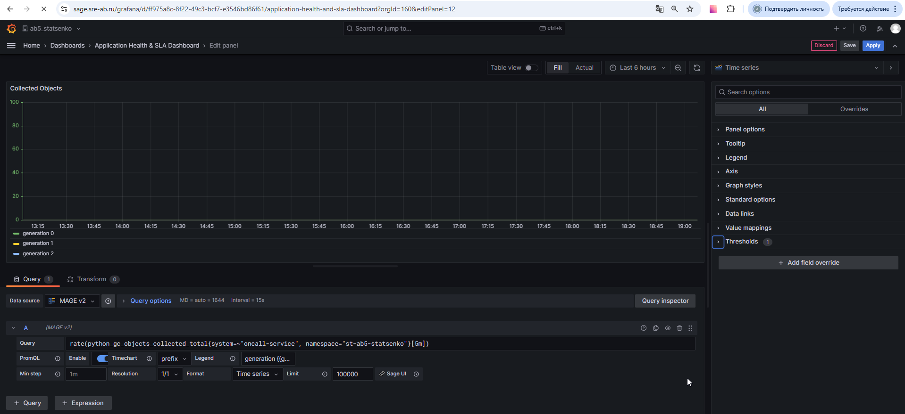

### Пробер

**prober_delete_team_scenario_total{system="oncall-prober-service", namespace="st-ab5-statsenko"}** используется для получения суммарного количества запросов на удаление команды

Панель для контейнера **Oncall-prober**:
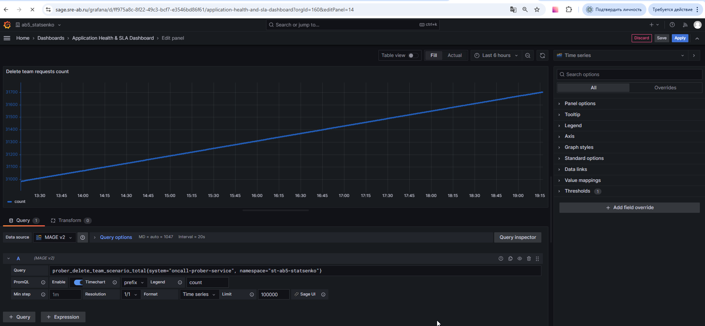

**prober_delete_team_scenario_success_total{system="oncall-prober-service", namespace="st-ab5-statsenko"}** используется для получения суммарного количества успешных запросов на удаление команды

Панель для контейнера **Oncall-prober**:
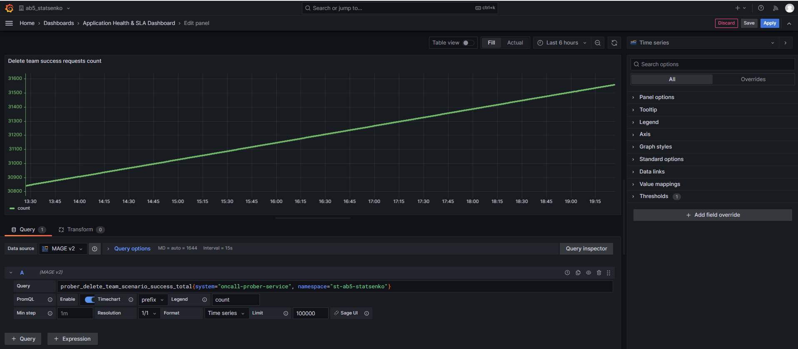

**prober_delete_team_scenario_fail_total{system="oncall-prober-service", namespace="st-ab5-statsenko"}** используется для получения суммарного количества неуспешных запросов на удаление команды

Панель для контейнера **Oncall-prober**:
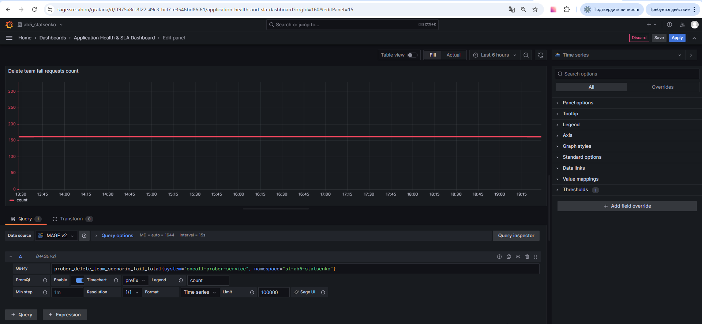

**prober_create_team_scenario_duration_milliseconds{system="oncall-prober-service", namespace="st-ab5-statsenko"}** показывает время выполнения запроса на создание команды 

Панель для контейнера **Oncall-prober**:
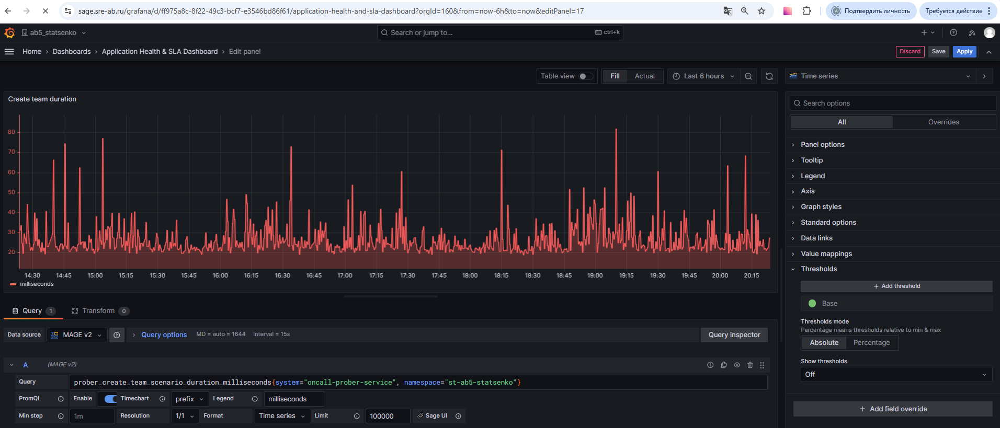

### SLA-калькулятор
**sla_calculator_delete_team_scenario_success_percent{system="oncall-sla-calculator-service", namespace="st-ab5-statsenko"}** показывает значение sla для доступности API удаления команды. 

Формула расчета: `(количество успешных запросов / общее количество запросов) * 100%`

Панель для контейнера **Oncall-sla-calculator**:
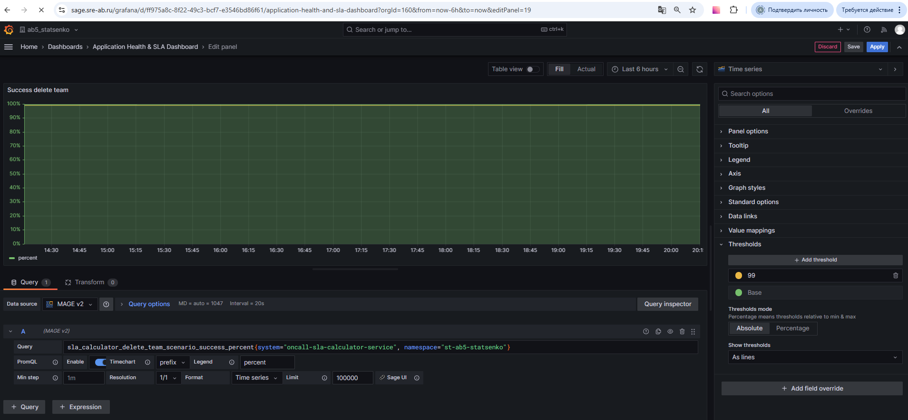

**sla_calculator_p98_create_team_duration_millis{system="oncall-sla-calculator-service", namespace="st-ab5-statsenko"}** - показывает значение sla для времени выполнения запроса на создание команды.
Формула расчета: `98-й перцентиль времени выполнения запроса на создание команды`.

Панель для контейнера **Oncall-sla-calculator**:
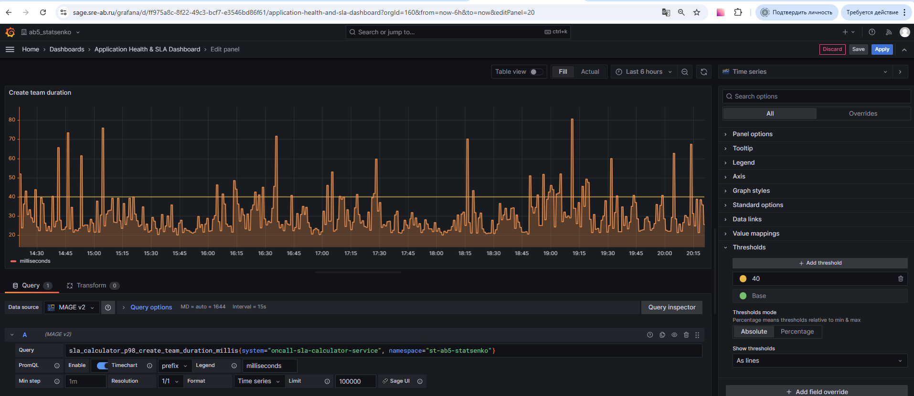

## Состояние дашборда до сбоя 
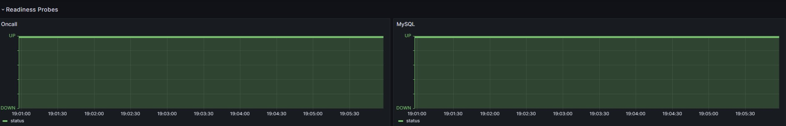
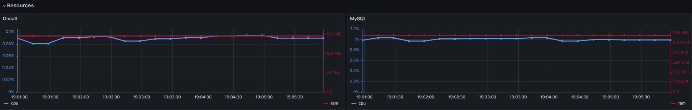
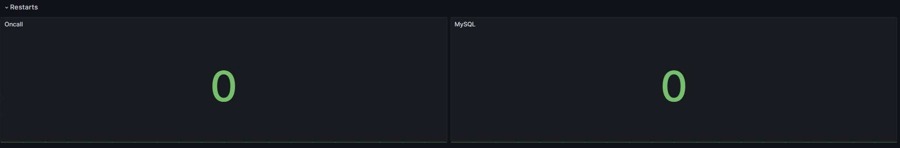
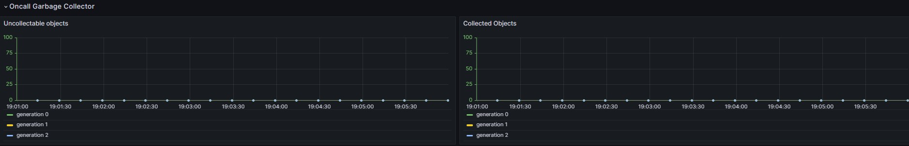
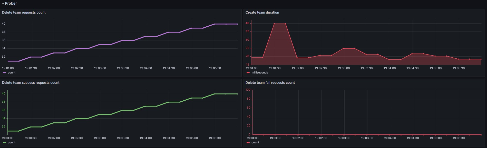
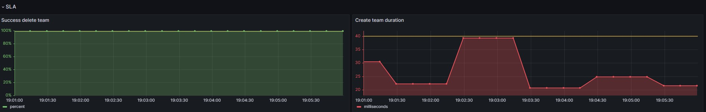

**Описание состояния до сбоя:**
- все readiness пробы проходят успешно
- доступна информация потребления контейнерами cpu и ram
- количество рестартов равно 0
- метрики Garbage Collector для Oncall доступны
- количество запросов на удаление команды увеличивается на 2 каждую минуту, поскольку пробер обращается к API Oncall каждые 30 секунд
- количество успешных запросов на удаление команды увеличивается на 2
- количество неуспешных запросов на удаление команды не увеличивается
- большинство запросов на создание команды выполняется быстрее, чем 40 миллисекунд
- SLA по удалению команды выполняется (100% запросов завершаются успешно)
- SLA по времени выполнения запроса на создание команды выполняется (98-й перцентиль времени выполнения запроса на создание команды не превышает 40 миллисекунд)

```
Выполняем команду: kubectl scale deployment oncall --replicas 0
```

## Состояние дашборда после сбоя 
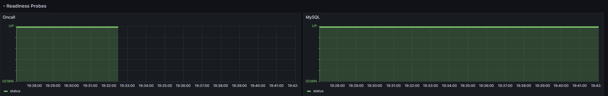
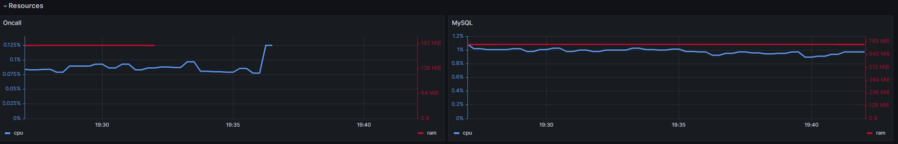
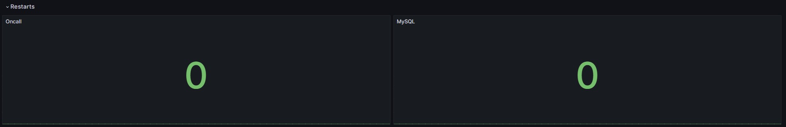
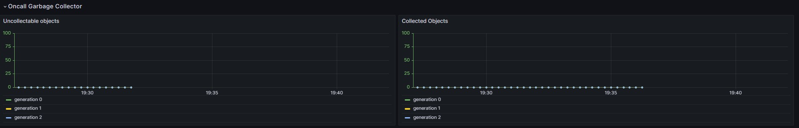
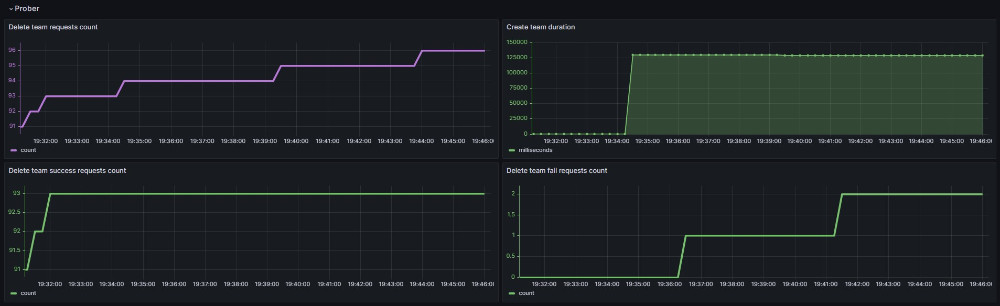
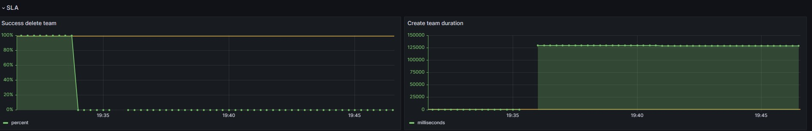

**Описание состояния после сбоя:**
- информация об успешности readiness probe для контейнера oncall отсутствует 
- отсутствует информация потребления контейнером oncall cpu и ram
- количество рестартов не изменилось, поскольку пода больше нет и он не перезапускался (остались старые значения, поскольку был расчет прироста за последний час)
- метрики Garbage Collector для Oncall теперь недоступны
- количество запросов на удаление команды увеличивается медленнее, поскольку из-за ретраев время выполнения запросов увеличивается
- количество успешных запросов на удаление команды больше не увеличивается
- количество неуспешных запросов на удаление команды стало увеличиваться
- время выполнения запросов на создание команды многократно выросло из-за ретраев
- SLA по удалению команды больше не выполняется (0% запросов завершаются успешно)
- SLA по времени выполнения запроса на создание команды больше не выполняется (98-й перцентиль времени выполнения запроса на создание команды значительно превышает 40 миллисекунд)

```
Ссылка на дашборд с Lock time range: https://sage.sre-ab.ru/grafana/d/ff975a8c-8f22-49c3-bcf7-e3546bd86f61/application-health-and-sla-dashboard?orgId=160&from=1763307120000&to=1763308260000 (время просадки: от 16.11.2025 19:32:30 - 16.11.2025 19:50:15)
```