# Выполнение 9 домашнего задания

## Настройка адреса для отправки алертов

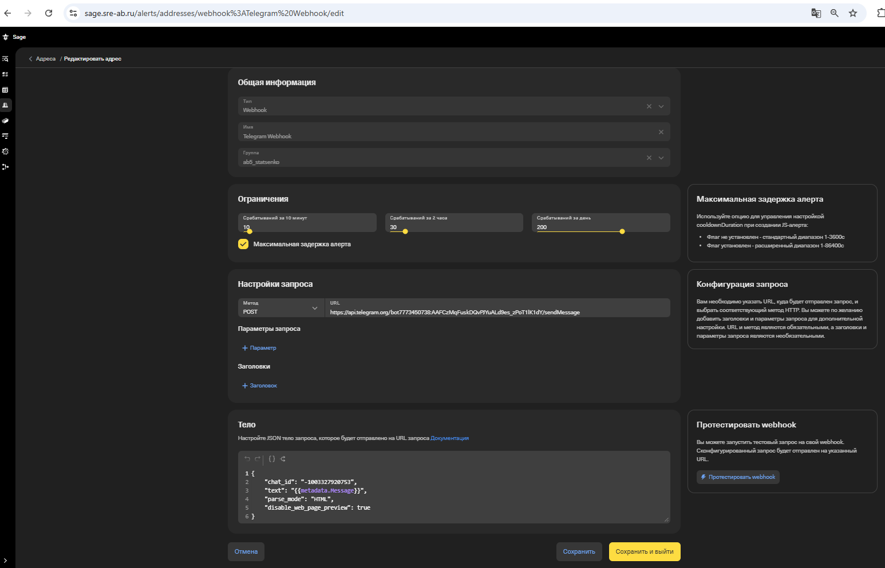

```
Телеграмм канал с алертами: https://t.me/alert_channel_ab5_statsenko
```

## Настройка алертов для системных метрик

Для создания алертов были выбраны следующие системные метрики: статус выполнения контейнерами readiness probe и потребление CPU. 

**Readiness probe** является прямым индикатором работоспособности приложения: если контейнер не проходит эту проверку, он автоматически исключается из балансировки нагрузки, что означает фактическую недоступность сервиса для пользователей. 

**Потребление CPU** было выбрано как индикатор аномальной нагрузки. Резкий рост использования CPU может сигнализировать о проблемах с производительностью приложения, например, в приложении могут присутствовать бесконечные циклы или аномальная активность, вызванная внешними факторами.

Настройка алерта для метрики readiness probe для контейнера oncall:
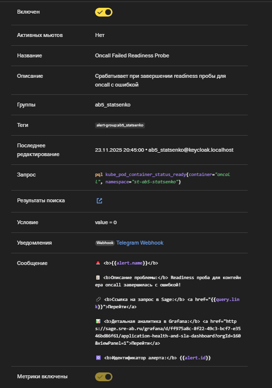
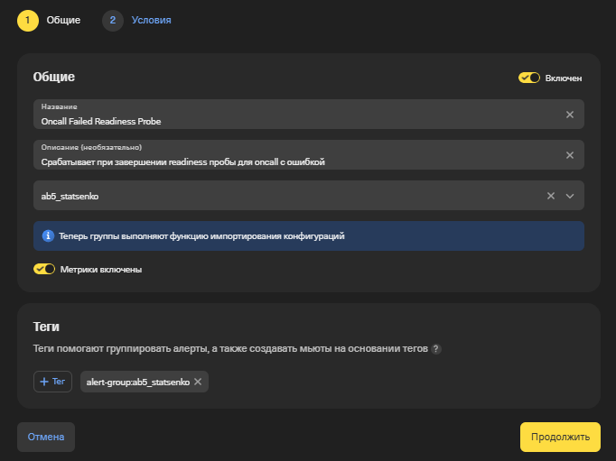
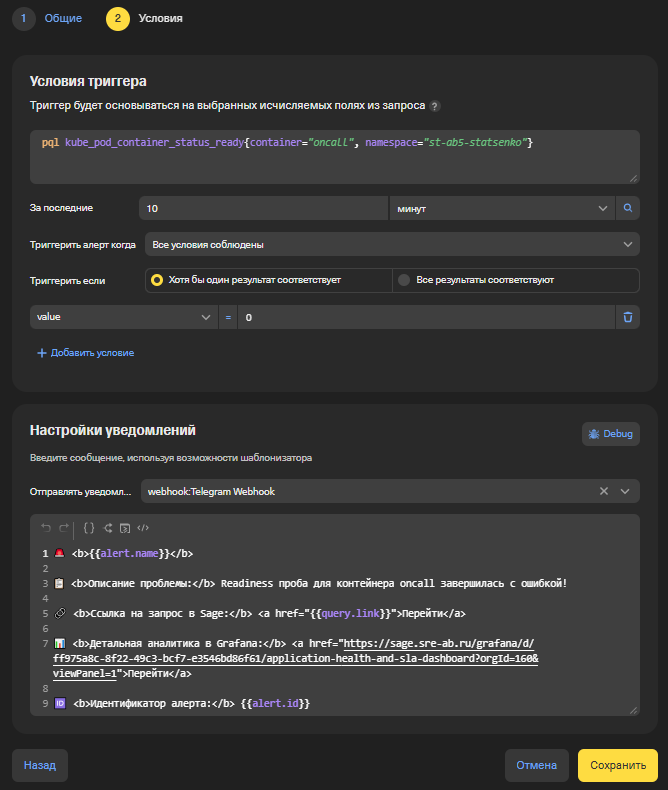
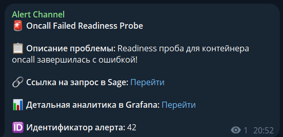
```
Ссылка на алерт: https://sage.sre-ab.ru/alerts/alerts/42/view
```

Настройка алерта для метрики readiness probe для контейнера mysql:
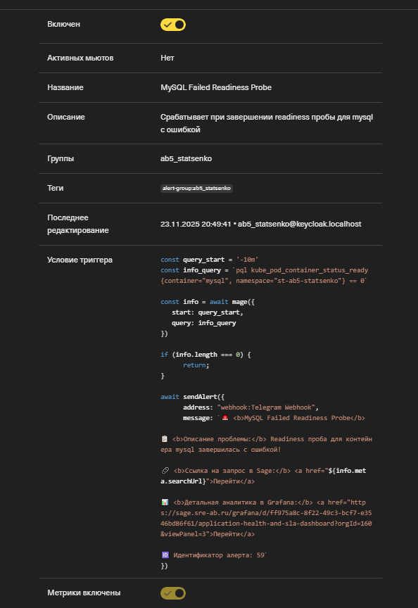
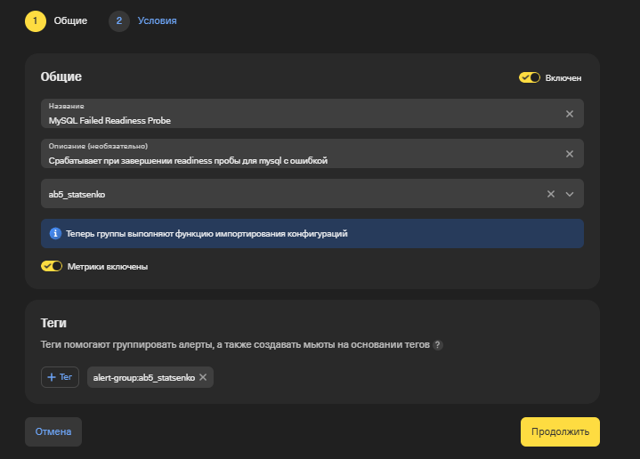

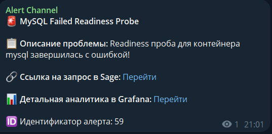
```
Ссылка на алерт: https://sage.sre-ab.ru/alerts/alerts/59/view
```

Настройка алерта для метрики потребления CPU для контейнера oncall:
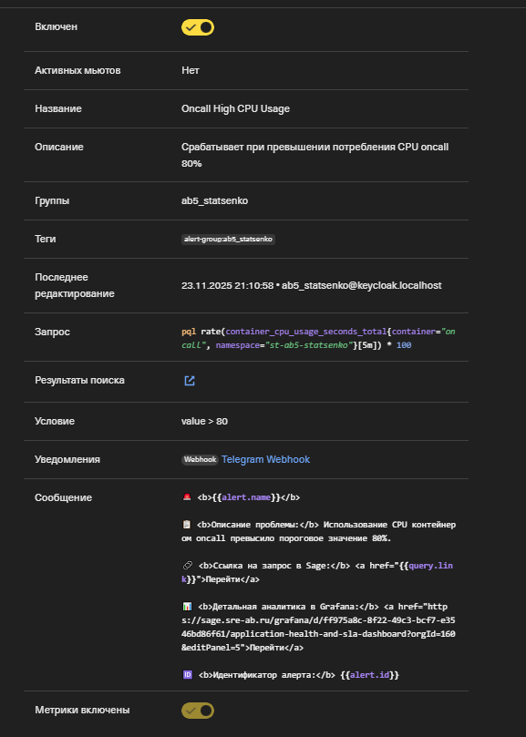
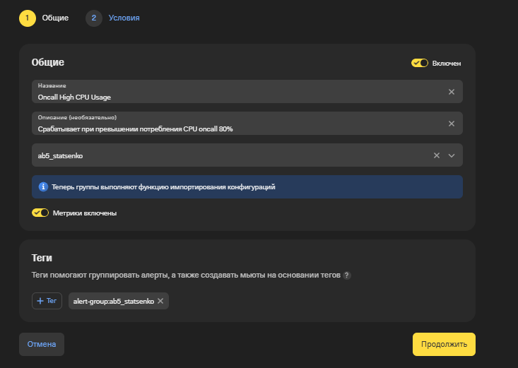
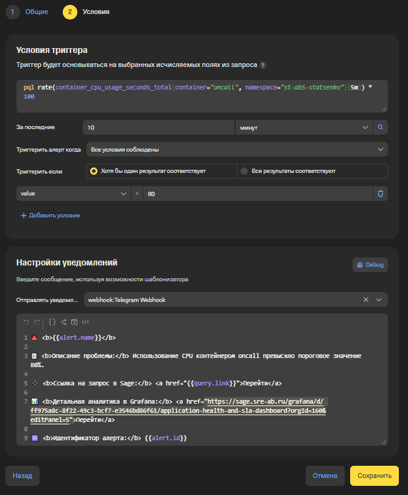
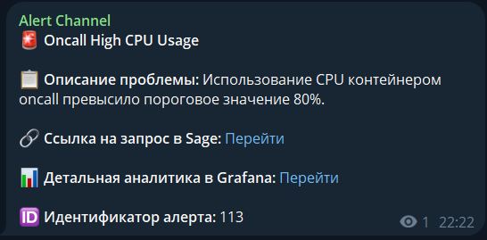
```
Ссылка на алерт: https://sage.sre-ab.ru/alerts/alerts/113/view
```

Настройка алерта для метрики потребления CPU для контейнера mysql:
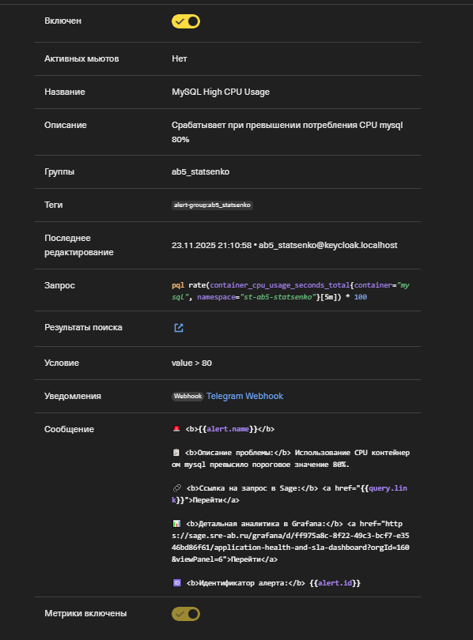
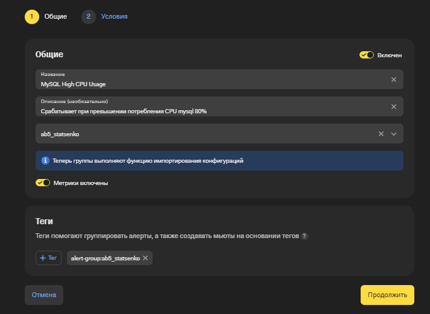
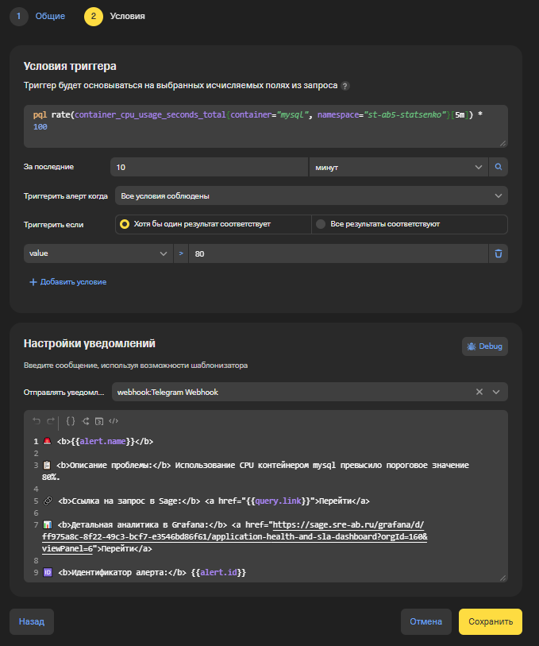
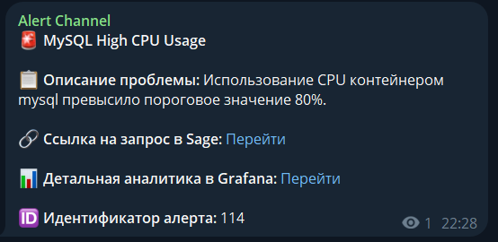
```
Ссылка на алерт: https://sage.sre-ab.ru/alerts/alerts/114/view
```

# Настройка алертов для метрик пробера

Для создания алертов были выбраны следующие метрики пробера: количество неудачных запросов на удаление команды и время выполнения запроса на создание команды. 

Настройка алерта для метрики количества неудачных запросов на удаление команды в oncall:

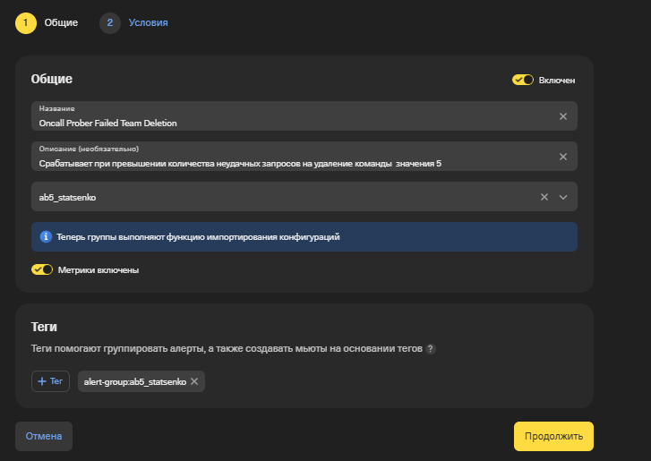
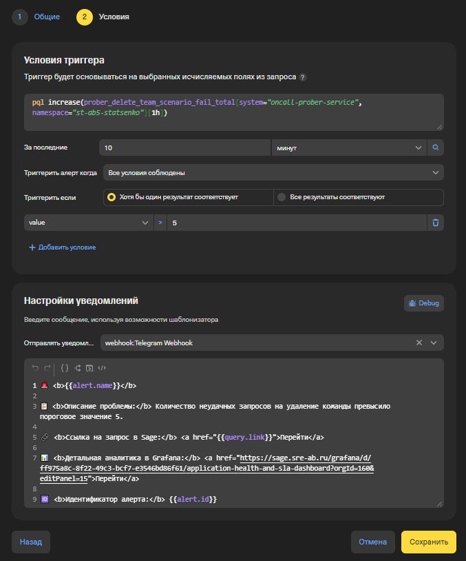
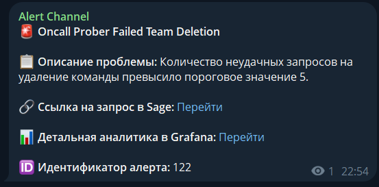
```
Ссылка на алерт: https://sage.sre-ab.ru/alerts/alerts/122/view
```

Настройка алерта для метрики времени выполнения запроса на создание команды в oncall:
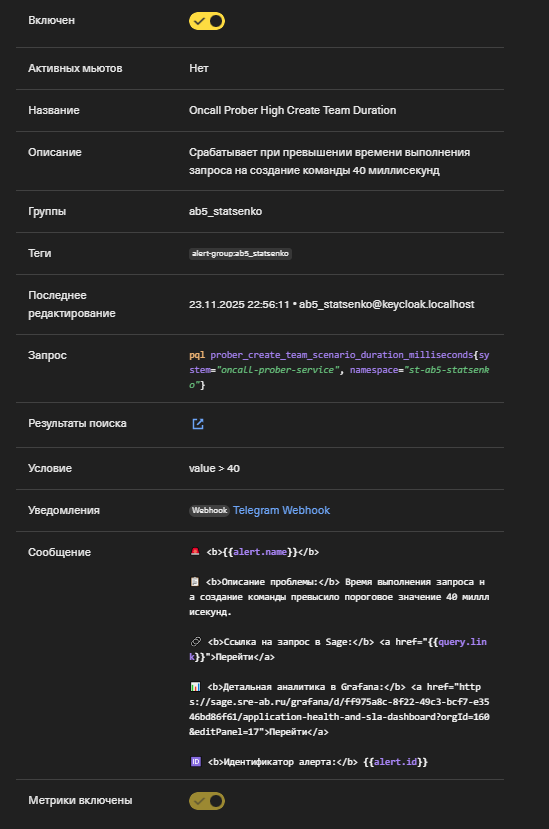

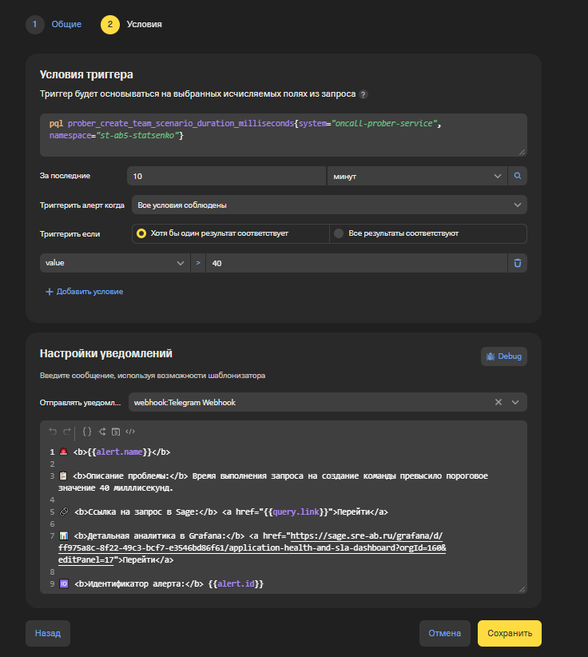
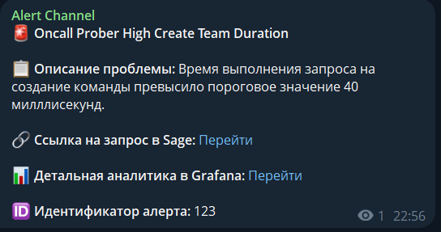
```
Ссылка на алерт: https://sage.sre-ab.ru/alerts/alerts/123/view
```

**После закрытия 9 домашнего задания токен будет везде удален**