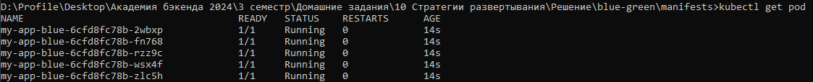
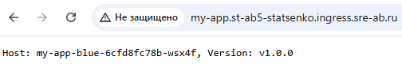
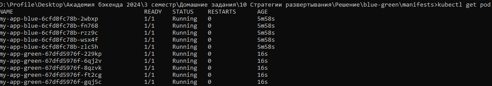
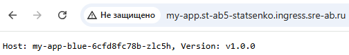
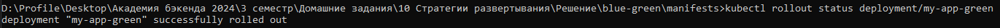
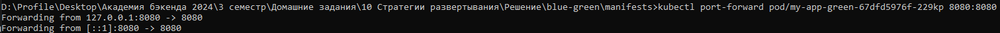
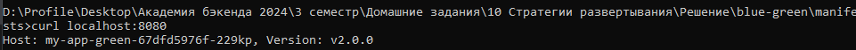

# Развертывание Blue-Green в Kubernetes

```
Blue-Green - стратегия развертывания, при которой поддерживаются две идентичные среды, но одновременно активна только одна из них.
```

## Текущее состояние

В кластере развернута старая версия приложения:

```
apiVersion: apps/v1
kind: Deployment
metadata:
  name: my-app-blue
  namespace: st-ab5-statsenko
  labels:
    app: my-app
spec:
  replicas: 5
  selector:
    matchLabels:
      app: my-app
      type: blue
  template:
    metadata:
      labels:
        app: my-app
        type: blue
        version: v1.0.0
      annotations:
        sage/group: "ab5_statsenko"
    spec:
      containers:
        - name: my-app
          resources:
            requests:
              cpu: 100m
              memory: 128Mi
            limits:
              cpu: 250m
              memory: 256Mi
          image: containersol/k8s-deployment-strategies
          env:
            - name: VERSION
              value: "v1.0.0"
          imagePullPolicy: IfNotPresent
          ports:
            - name: http
              containerPort: 8080
            - name: metrics
              containerPort: 9101
            - name: probe
              containerPort: 8086
          livenessProbe:
            httpGet:
              path: /live
              port: 8086
            initialDelaySeconds: 5
            periodSeconds: 5
          readinessProbe:
            httpGet:
              path: /ready
              port: 8086
            initialDelaySeconds: 5
            periodSeconds: 5
```
* запущено 5 подов
* версия v1.0.0
* в стратегии Blue-Green это Blue

**Запущенные поды**:


Весь трафик идет на старую версию (type имеет значение blue):
```
apiVersion: v1
kind: Service
metadata:
  name: my-app-service
  namespace: st-ab5-statsenko
  labels:
    app: my-app
  annotations:
    prometheus.io/scrape: "true"
    prometheus.io/port: "9101"
    prometheus.io/path: /metrics
spec:
  type: ClusterIP
  selector:
    app: my-app
    type: blue
  ports:
    - name: http
      protocol: TCP
      port: 8080
      targetPort: 8080
    - name: metrics
      protocol: TCP
      port: 9101
      targetPort: 9101
```

Все внешние запросы направляются к **my-app-service**:
```
apiVersion: networking.k8s.io/v1
kind: Ingress
metadata:
  name: my-app-ingress
  namespace: st-ab5-statsenko
spec:
  ingressClassName: nginx
  rules:
    - host: my-app.st-ab5-statsenko.ingress.sre-ab.ru
      http:
        paths:
          - path: "/"
            pathType: Prefix
            backend:
              service:
                name: my-app-service
                port:
                  number: 8080
```

При обращении по адресу http://my-app.st-ab5-statsenko.ingress.sre-ab.ru/ получаем ответ:


## Процесс развертывания

1. Выполним команду **kubectl apply -f deployment-green.yaml**, развернув деплоймент с новой версией в Kubernetes:
```
apiVersion: apps/v1
kind: Deployment
metadata:
  name: my-app-green
  namespace: st-ab5-statsenko
  labels:
    app: my-app
spec:
  replicas: 5
  selector:
    matchLabels:
      app: my-app
      type: green
  template:
    metadata:
      labels:
        app: my-app
        type: green
        version: v2.0.0
      annotations:
        sage/group: "ab5_statsenko"
    spec:
      containers:
        - name: my-app
          resources:
            requests:
              cpu: 100m
              memory: 128Mi
            limits:
              cpu: 250m
              memory: 256Mi
          image: containersol/k8s-deployment-strategies
          env:
            - name: VERSION
              value: "v2.0.0"
          imagePullPolicy: IfNotPresent
          ports:
            - name: http
              containerPort: 8080
            - name: metrics
              containerPort: 9101
            - name: probe
              containerPort: 8086
          livenessProbe:
            httpGet:
              path: /live
              port: 8086
            initialDelaySeconds: 5
            periodSeconds: 5
          readinessProbe:
            httpGet:
              path: /ready
              port: 8086
            initialDelaySeconds: 5
            periodSeconds: 5
```
* запущено 5 подов
* версия v2.0.0
* в стратегии Blue-Green это Green

**Запущенные поды**:


Трафик по прежнему идет на старую версию (Blue):


2. Теперь необходимо убедиться, что новая версия работает корректно. 

С помощью команды **kubectl rollout status deployment/my-app-green** видим, что развертывание прошло успешно:


Для тестирования новой версии приложения выполним проброс портов для создания туннеля между локальной машиной и подом в кластере. 


Теперь попробуем выполнить запрос к этому поду. Получаем корректный результат и убеждаемся, что это именно новая версия приложения.


```
На примере показана проверка одного конкретного пода, то же самое нужно сделать со всеми подами новой версии приложения в кластере
```

3. Переключение трафика. После того, как мы полностью убедились, что новая версия приложения работает корректно, настраиваем перенаправление на нее трафика. Для этого необходимо изменить в service.yaml значение type c blue на green:
```
apiVersion: v1
kind: Service
metadata:
  name: my-app-service
  namespace: st-ab5-statsenko
  labels:
    app: my-app
  annotations:
    prometheus.io/scrape: "true"
    prometheus.io/port: "9101"
    prometheus.io/path: /metrics
spec:
  type: ClusterIP
  selector:
    app: my-app
    type: green
  ports:
    - name: http
      protocol: TCP
      port: 8080
      targetPort: 8080
    - name: metrics
      protocol: TCP
      port: 9101
      targetPort: 9101
```

После переключения трафика все запросы перенаправляются на новую версию приложения:


