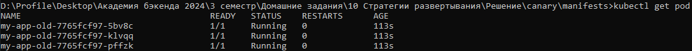
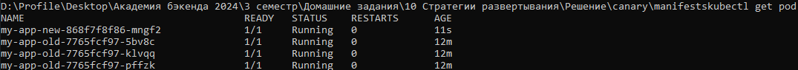
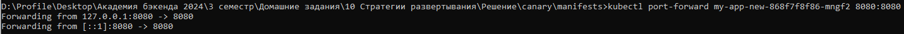
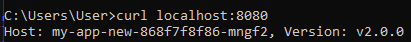
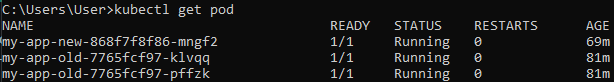
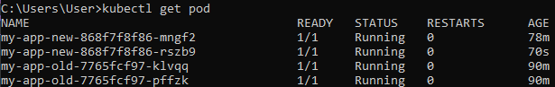
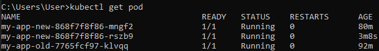
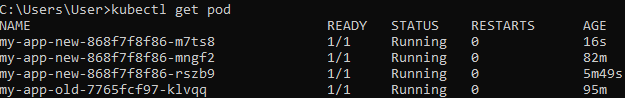
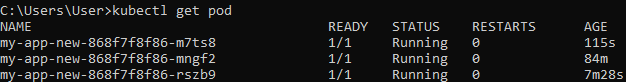
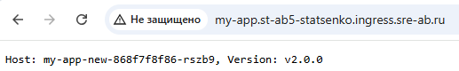

# Canary развертывание в Kubernetes

```
Canary - это стратегия постепенного обновления приложения, при которой обновление сначала получает только небольшая часть пользователей, а большая часть остаются на старой версии. По мере тестирования новой версии, новая будет постепенно заменять старую.
```

## Текущее состояние

В кластере развернута старая версия приложения:
```
apiVersion: apps/v1
kind: Deployment
metadata:
  name: my-app-old
  namespace: st-ab5-statsenko
  labels:
    app: my-app    
spec:
  replicas: 3
  selector:
    matchLabels:
      app: my-app
  template:
    metadata:
      labels:
        app: my-app
      annotations:
        sage/group: "ab5_statsenko"
    spec:
      containers:
        - name: my-app
          resources:
            requests:
              cpu: 100m
              memory: 128Mi
            limits:
              cpu: 250m
              memory: 256Mi
          image: containersol/k8s-deployment-strategies
          env:
            - name: VERSION
              value: "v1.0.0"
          imagePullPolicy: IfNotPresent
          ports:
            - name: http
              containerPort: 8080
            - name: metrics
              containerPort: 9101
            - name: probe
              containerPort: 8086
          livenessProbe:
            httpGet:
              path: /live
              port: 8086
            initialDelaySeconds: 5
            periodSeconds: 5
          readinessProbe:
            httpGet:
              path: /ready
              port: 8086
            initialDelaySeconds: 5
            periodSeconds: 5
```
* запущено 3 пода
* версия v1.0.0

**Запущенные поды**:


Service направляет трафик на старую версию:
```
apiVersion: v1
kind: Service
metadata:
  name: my-app-service
  namespace: st-ab5-statsenko
  labels:
    app: my-app
  annotations:
    prometheus.io/scrape: "true"
    prometheus.io/port: "9101"
    prometheus.io/path: /metrics
spec:
  type: ClusterIP
  selector:
    app: my-app
  ports:
    - name: http
      protocol: TCP
      port: 8080
      targetPort: 8080
    - name: metrics
      protocol: TCP
      port: 9101
      targetPort: 9101
```

Все внешние запросы направляются в **my-app-service**:
```
apiVersion: networking.k8s.io/v1
kind: Ingress
metadata:
  name: my-app-ingress
  namespace: st-ab5-statsenko
spec:
  ingressClassName: nginx
  rules:
    - host: my-app.st-ab5-statsenko.ingress.sre-ab.ru
      http:
        paths:
          - path: "/"
            pathType: Prefix
            backend:
              service:
                name: my-app-service
                port:
                  number: 8080
```

При обращении по адресу http://my-app.st-ab5-statsenko.ingress.sre-ab.ru/ получаем ответ:


## Процесс развертывания

1. Выполним команду **kubectl apply -f deployment-v2.yaml**, развернув деплоймент с новой версией в Kubernetes:
```
apiVersion: apps/v1
kind: Deployment
metadata:
  name: my-app-new
  namespace: st-ab5-statsenko
  labels:
    app: my-app    
spec:
  replicas: 1
  selector:
    matchLabels:
      app: my-app
  template:
    metadata:
      labels:
        app: my-app
      annotations:
        sage/group: "ab5_statsenko"
    spec:
      containers:
        - name: my-app
          resources:
            requests:
              cpu: 100m
              memory: 128Mi
            limits:
              cpu: 250m
              memory: 256Mi
          image: containersol/k8s-deployment-strategies
          env:
            - name: VERSION
              value: "v2.0.0"
          imagePullPolicy: IfNotPresent
          ports:
            - name: http
              containerPort: 8080
            - name: metrics
              containerPort: 9101
            - name: probe
              containerPort: 8086
          livenessProbe:
            httpGet:
              path: /live
              port: 8086
            initialDelaySeconds: 5
            periodSeconds: 5
          readinessProbe:
            httpGet:
              path: /ready
              port: 8086
            initialDelaySeconds: 5
            periodSeconds: 5
```
* запущен 1 под
* версия v2.0.0

**Запущенные поды**:


Теперь у нас **4 пода**: 3 пода со старой версией, один с новой, значит 1/4 = 0.25 => **25% подов** содержат новую версию приложения.

```
Теперь 25% трафика будет направляться на новую версию приложения.
```

2. Теперь необходимо убедиться, что под с новой версией приложения работает корректно

Для тестирования новой версии приложения выполним проброс портов для создания туннеля между локальной машиной и подом в кластере. 


Теперь попробуем выполнить запрос к этому поду. Получаем корректный результат и убеждаемся, что это именно новая версия приложения.



```
На примере показана проверка одного конкретного пода, то же самое нужно сделать со всеми подами новой версии приложения в кластере прежде чем продолжать развертывание.
```

3. Удаляем один старый под. Для этого необходимо указать команду **kubectl scale --replicas=2 deploy my-app-old**

**Запущенные поды:**

```
Теперь 33% трафика будет направляться на новую версию приложения.
```

4. Увеличиваем количество подов с новой версией приложения, применив команду **kubectl scale --replicas=2 deploy my-app-new**

**Запущенные поды:**

```
Теперь 50% трафика будет направляться на новую версию приложения.
```

5. Удаляем один старый под. Для этого необходимо указать команду **kubectl scale --replicas=1 deploy my-app-old**

**Запущенные поды:**

```
Теперь 66% трафика будет направляться на новую версию приложения.
```

6. Увеличиваем количество подов с новой версией приложения, применив команду **kubectl scale --replicas=3 deploy my-app-new**

**Запущенные поды:**

```
Теперь 75% трафика будет направляться на новую версию приложения.
```

7. Удаляем последний старый под. Для этого необходимо указать команду **kubectl scale --replicas=0 deploy my-app-old**

**Запущенные поды:**

```
Теперь 100% трафика будет направляться на новую версию приложения.
```

**Результат развертывания в браузере:**



